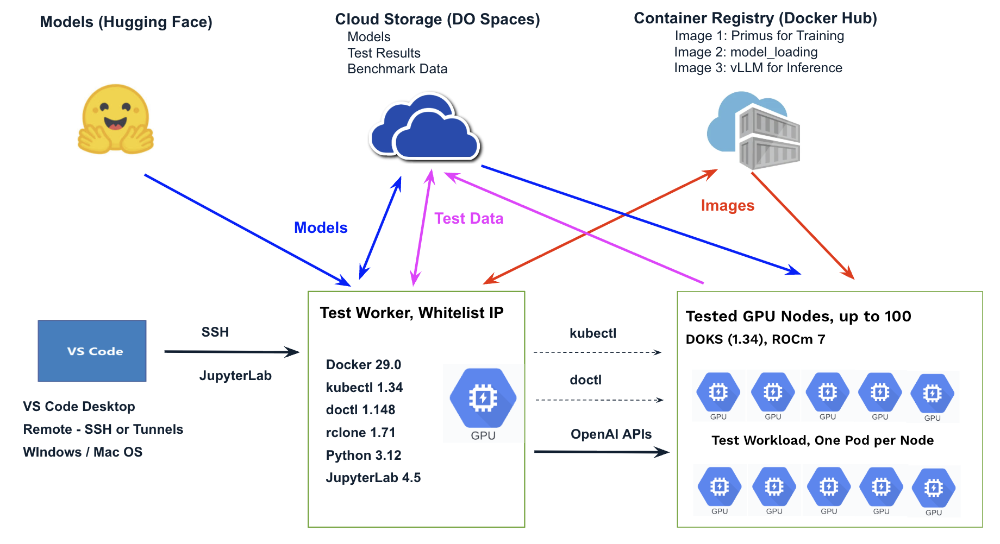

# AMD Validation Test (V1)

This repository provides resources to validate a batch of AMD GPU nodes by running training and inference workloads. After execution, per-node results—including logs and key benchmark metrics such as model loading time, training time, and server startup time—are collected for analysis.

The goal is to complete testing and collect all data from up to 100 nodes within 2 hours, with minimal human intervention.

## System Architecture and Design Overview

The system contains following components:



- **GPU Nodes** - These nodes will run ROCm 7 and be managed by DOKS 1.34. During testing, each node will execute a test workload as a single pod that utilizes all 8 GPUs to run training and inference jobs sequentially. The workload will upload job logs (unstructured data) and benchmark metrics (structured data) to cloud storage (DO Spaces), using the DOKS worker name as the file name. To reduce concurrent access to Hugging Face and minimize system startup time, we pre-download the required models to the cloud storage and load them onto the DOKS worker nodes before use.

- **Test Workload** - The workload consists of two init containers (training and model loading) and one main container (inference). The training container defines and trains a new model from scatch based on a specific architecture, running only for a few epochs, which takes roughly tens of minutes. The inference container requires a pre-trained model, which is loaded by the model-loading init container, and then runs continuously. Each container transitions through multiple states, and its logs and metrics are uploaded to DO Spaces whenever a state change occurs. Monitoring these files allows us to track test progress in real time.

- **Test Worker** - This is the central node where all tasks are performed, including coding and building images, transferring data (models, images, and test data), provisioning DOKS, launching tests, monitoring, and executing post-test tasks such as data analysis and conversion. The node requires a GPU to support testing of code and images, as well as high network bandwidth to communicate with all other components.

- **Cloud Storage** - We create a test bucket in DO Spaces, which is S3-compatible and supported by rclone. A unique folder is used to store the test results and benchmark metrics for each batch test. Required pre-trained models are also preloaded and saved in the bucket. We skipped using the NFS share for this purpose, as it is specific to a region and VPC, and does not scale as well as the object store. We may explore using a NoSQL database to manage benchmark metrics in JSON format, enabling easier access and analysis.

- **Container Repository** - We are currently using Docker Hub to store the 3 customer images for training, model loading, and inference. Concurrent access by hundreds of DOKS worker nodes may be throttled, so alternative solutions may be considered in the future.


## Cloud Setup (One-Time)

Ensure the cloud environment is properly configured and all necessary access is granted before performing the test tasks.

- **Hugging Face** - Ensure you have an account and proper access. For gated models, the required agreements must be signed before downloading them using an access token.

- **Docker Hub** - Ensure you have an account and access.

- **DO** - Ensure you have an account and access. Provision the bucket and generate its access key. Prepare the SSH key and generate the necessary access tokens for doctl.

## Test Worker Setup (One-Time)

Provision a GPU Droplet in DO with an additional data volume (1 TB recommended for transferring large models).

Whitelist the public IP address from which you will access the droplet.

Access the test worker using VS Code and install the necessary extensions.

Install and set up required tools: Docker, kubectl, doctl, rclone, etc.

Install Python libraries: python-dotenv, JupyterLab, pandas, numpy, matplotlib, etc.

Clone this repository using VS Code’s Git integration.

Create a .env file in the root of the workspace folder (V1):

```
# No need to generate a Docker Hub token at this time.
# Connect the Test Worker to Docker Hub using interactive authentication.
# Use public images for this setup.

# The token to download private and gated models in Hugging Face. 
# For gated models, agreements must be signed first before downloading.
HF_TOKEN="***********************"

# The token to provision resources in DO, required when setting up doctl.
DO_TOKEN="***********************"

# The bucket to keep the models and test data.
BUCKET=rs-validation-test

# The access to the bucket in DO Spaces, which is required for both the test worker and the test workloads running in DOKS. 
AWS_ENDPOINT_URL=atl1.digitaloceanspaces.com
AWS_ACCESS_KEY_ID="***********************"
AWS_SECRET_ACCESS_KEY="***********************"
AWS_REGION=atl1

# The task folder to keep data for a specifc test.
# {BUCKET}/{FOLDER}/benchamrk/model_loading/{NODE_NAME}.log
# {BUCKET}/{FOLDER}/megatron/{NODE_NAME}.log
# {BUCKET}/{FOLDER}/llama/{NODE_NAME}.log
FOLDER=test20251213

# ID of the model for inference testing.
MODEL=meta-llama/Llama-3.1-8B-Instruct

# The model folder name, which should align with the one generated and used by the vLLM server running the model ID.
MODEL_FOLDER=models--meta-llama--Llama-3.1-8B-Instruct

# The model location in DO Spaces
# {BUCKET}/models/{MODEL_FOLDER}

# The model location in pods, while /root/.cache/huggingface should be mounted as a volume from the host.
# /root/.cache/huggingface/hub/{MODEL_FOLDER}

# Node Name for local test, which will be replaced by the DOKS worker name
NODE_NAME=local
```

## Preloading Models from Hugging Face (One-Time)

A few models have been preloaded into the bucket - `rs-validation-test` in DO Spaces, including Llama, Qwen and DeepSeek. We can run this code on the Test Worker to check:

python3 [V1/1_images/test_list_models.py](V1/1_images/test_list_models.py)

To preload additional models, we require a node with a GPU, larger local disk space (>=1TB), and good network bandwidth to both Hugging Face and DO Spaces. This is a one-time task that can be performed manually, using either the Test Worker or a pod running on DOKS.

Basic steps for a model:

- Download the model from Hugging Face to the local directory (/root/.cache/huggingface/hub/) and run it using a vLLM server.

- Test the inference to ensure it works as expected.

- Upload the model to DO Spaces using rclone. Any symlinks in the downloaded model data should be resolved during the upload.

- Delete the local model.

- Download the model from DO Spaces to the local directory (/root/.cache/huggingface/hub/) using rclone.

- Run the model using a vLLM server and test the inference.

Check [V1/9_model_preloading_from_huggingface](V1/9_model_preloading_from_huggingface) and [V1/8_model_loading_test](V1/8_model_loading_test) for more details.


## Per-Batch Test Execution 

### Step 1: Requirement Confirmation and Envrionment Preparation

Confirm the key requirements, including the node type/slug to be tested, quantity, region, DOKS version, testing timeline, and the destination for uploading final results.

Ensure all required dependencies are accessible and ready: Docker Hub, Hugging Face, Do, DO Spaces, and the Test Worker.

Define the task folder in the bucket and the naming schema for all resources, including DOKS clusters and node pools, that will be created during the test.

Prepare or update the .env file, scripts (doctl) and K8S manifest files on the Test Worker.

The code and images may be fine-tuned for each task to validate various solution options and accumulate experiences.

### Step 2: Provision the DOKS on the Test Worker

Provision the DOKS using doctl, enabling it to request extra nodes and automatically incorporate newly added nodes. Here are some examples:

```
# Example 1: Provision a DOKS cluster in a specific VPC within the atl1 region, consisting of 2 CPU nodes, 2 M350X nodes with the Multi-Node setup (RoCE), and 2 MI325X nodes with the Multi-Node setup (RoCE).

doctl kubernetes cluster create rs-amd-20251212-alt1 \
  --region atl1 \
  --vpc-uuid d7489d54-76ff-47b6-b214-2162e69c52a2 \
  --version 1.34.1-do.1 \
  --node-pool "name=rs-amd-20251212-cpu-pool;size=s-4vcpu-8gb-amd;count=2" \
  --node-pool "name=rs-amd-20251212-gpu-325-pool;size=gpu-mi325x8-2048gb-fabric-contracted;count=2" \
  --node-pool "name=rs-amd-20251212-gpu-350-pool;size=gpu-mi350x8-2304gb-fabric-contracted;count=2" \
  --tag "rs-amd-20251212"

# Example 2: Provision a DOKS cluster in the default VPC within the nyc2 region, consisting of 2 CPU nodes, 50 M350X nodes and 50 MI325X nodes.
doctl kubernetes cluster create rs-amd-20251111-nyc2 \
  --region nyc2 \
  --version 1.34.1-do.1 \
  --node-pool "name=rs-amd-20251111-cpu-pool;size=s-4vcpu-8gb-amd;count=2" \
  --node-pool "name=rs-amd-20251111-gpu-325-pool;size=gpu-mi350x8-2304gb-contracted;count=50" \
  --node-pool "name=rs-amd-20251111-gpu-350-pool;size=gpu-mi350x8-2304gb-contracted;count=50" \
  --tag "rs-amd-20251111"
```

Common doctl commands include:

```
doctl vpcs list

# Get the DOKS name and ID
doctl kubernetes cluster list

doctl kubernetes cluster get DOKS_ID
doctl kubernetes cluster get DOKS_ID -o json
doctl kubernetes cluster delete DOKS_ID
```

### Step 3: Launch the Test Workload on the Test Worker

Review the secrets and environment variables defined in the manifest files to ensure they are correctly configured.

Create the secret for Hugging Face and DO Spaces access:

kubectl apply -f [V1/2_environment_test/21_doks_access.yaml](V1/2_environment_test/21_doks_access.yaml)

Deploy the test workload - `megatron-llama`:

kubectl apply -f [V1/2_environment_test/22_doks_test.yaml](V1/2_environment_test/22_doks_test.yaml)

**To reduce concurrent access to Docker Hub, we can start with a smaller number of replicas and gradually scale up over time. The replica count can exceed the current number of GPU nodes, enabling the test to run automatically on newly added nodes.** Common kubectl commands include:

```
# Check the number of GPU nodes 
kubectl get node
kubectl get node | grep gpu | wc

kubectl apply -f 21_doks_access.yaml
kubectl delete -f 21_doks_access.yaml

kubectl apply -f 22_doks_test.yaml
kubectl delete -f 22_doks_test.yaml

# Adjust the replica number of deployment - megatron-llama
kubectl scale deployment megatron-llama --replicas=10 

kubectl get pod -w # Watch the pods in real time
kubectl get pod -o wide

kubectl get secret
kubectl describe secret rs-environment-variables

kubectl describe deployment megatron-llama
kubectl describe pod megatron-llama-58dc769b55-99gqc

# Check the logs of init and main containers in a specifc pod
kubectl logs -f megatron-llama-58dc769b55-99gqc -c megatron-training-container
kubectl logs -f megatron-llama-58dc769b55-99gqc -c model-loader-container
kubectl logs -f megatron-llama-58dc769b55-99gqc -c vllm-inference-container
kubectl logs -f megatron-llama-58dc769b55-99gqc

# Exec into the running init containers
kubectl exec -it megatron-llama-58dc769b55-99gqc -c megatron-training-container -- /bin/bash
kubectl exec -it megatron-llama-58dc769b55-99gqc -c model-loader-container -- /bin/bash

# Exec into the running main container
kubectl exec -it megatron-llama-58dc769b55-99gqc -c vllm-inference-container -- /bin/bash
kubectl exec -it megatron-llama-58dc769b55-99gqc -- /bin/bash
```

### Step 4: Monitor the Progress on the Test Worker

The test workload consists of two init containers (training and model loading) and a main container (inference, running continuously), allowing easy monitoring of each pod’s lifecycle. If a pod encounters an issue in an init container, it will not proceed to the main container.

```
# All in the training stage
# kubectl get pod -o wide
NAME                              READY   STATUS     RESTARTS   AGE    IP             NODE                          
megatron-llama-58dc769b55-99gqc   0/1     Init:0/2   0          5m3s   10.153.2.237   rs002-fw-gpu-350-pool-spk44   
megatron-llama-58dc769b55-pvgvl   0/1     Init:0/2   0          5m3s   10.153.1.51    rs002-fw-gpu-325-pool-sr6zr   
megatron-llama-58dc769b55-tn96f   0/1     Init:0/2   0          5m3s   10.153.1.153   rs002-fw-gpu-350-pool-spk4h   
megatron-llama-58dc769b55-xjz7f   0/1     Init:0/2   0          5m3s   10.153.2.19    rs002-fw-gpu-325-pool-sr6zw

# 2 in the model loading stage and 2 in the inference state
# kubectl get pod -o wide
NAME                              READY   STATUS     RESTARTS   AGE   IP             NODE                         
megatron-llama-58dc769b55-99gqc   1/1     Running    0          17m   10.153.2.237   rs002-fw-gpu-350-pool-spk44   
megatron-llama-58dc769b55-pvgvl   0/1     Init:1/2   0          17m   10.153.1.51    rs002-fw-gpu-325-pool-sr6zr   
megatron-llama-58dc769b55-tn96f   1/1     Running    0          17m   10.153.1.153   rs002-fw-gpu-350-pool-spk4h  
megatron-llama-58dc769b55-xjz7f   0/1     Init:1/2   0          17m   10.153.2.19    rs002-fw-gpu-325-pool-sr6zw  

# All in the inference stage
# kubectl get pod -o wide
NAME                              READY   STATUS    RESTARTS   AGE   IP             NODE                          
megatron-llama-58dc769b55-99gqc   1/1     Running   0          18m   10.153.2.237   rs002-fw-gpu-350-pool-spk44   
megatron-llama-58dc769b55-pvgvl   1/1     Running   0          18m   10.153.1.51    rs002-fw-gpu-325-pool-sr6zr   
megatron-llama-58dc769b55-tn96f   1/1     Running   0          18m   10.153.1.153   rs002-fw-gpu-350-pool-spk4h   
megatron-llama-58dc769b55-xjz7f   1/1     Running   0          18m   10.153.2.19    rs002-fw-gpu-325-pool-sr6zw   
```

To review detailed test results and benchmark metrics, first download the logs and metrics files from DO Spaces by running the following code:

cd V1/3_monitoring_conversion; python3 [31_download.py](V1/3_monitoring_conversion/31_download.py)

You should navigate to the folder where the code resides and run the code to download the files into that same folder. The [.vscode/launch.json](.vscode/launch.json) file sets the current working directory to the folder containing the code, allowing you to debug (fn + F5 for Mac) or run(fn + control + F5 for Mac) the code directly from VS Code.

Each container (training, model loading, inference) transitions through multiple states, and its logs and metrics are uploaded to DO Spaces whenever a state change occurs. By running the following code to check these files, we can track detailed test information:

cd V1/3_monitoring_conversion; python3 [32_analyze.py](V1/3_monitoring_conversion/32_analyze.py)

```
---------> Analyze the megatron log files...
Files in test20251213/megatron: 4
Node: rs002-fw-gpu-325-pool-sr6zw, Training Time: 1035.635 seconds
Node: rs002-fw-gpu-350-pool-spk44, Training Time: 811.93 seconds
Node: rs002-fw-gpu-350-pool-spk4h, Training Time: 808.964 seconds
Node: rs002-fw-gpu-325-pool-sr6zr, Training Time: 1033.113 seconds

---------> Analyze the model loading log files...
Files in test20251213/benchmark/model_loading: 4
Node: rs002-fw-gpu-325-pool-sr6zw, Data Size: 16.07 GB, Duration: 21.168 seconds, Throughput: 6.073 Gbps
Node: rs002-fw-gpu-350-pool-spk44, Data Size: 16.07 GB, Duration: 22.202 seconds, Throughput: 5.79 Gbps
Node: rs002-fw-gpu-350-pool-spk4h, Data Size: 16.07 GB, Duration: 21.175 seconds, Throughput: 6.071 Gbps
Node: rs002-fw-gpu-325-pool-sr6zr, Data Size: 16.07 GB, Duration: 21.727 seconds, Throughput: 5.917 Gbps

---------> Analyze the llama log files...
Files in test20251213/llama: 4
Node: rs002-fw-gpu-325-pool-sr6zw, Startup Time: 70.02 seconds,  Running Time: 180.119 seconds, Inference Number: 11, Generated Token Number: 14593
Node: rs002-fw-gpu-350-pool-spk44, Startup Time: 70.019 seconds, Running Time: 421.354 seconds, Inference Number: 33, Generated Token Number: 46513
Node: rs002-fw-gpu-350-pool-spk4h, Startup Time: 65.018 seconds, Running Time: 423.807 seconds, Inference Number: 34, Generated Token Number: 47800
Node: rs002-fw-gpu-325-pool-sr6zr, Startup Time: 70.02 seconds,  Running Time: 189.27 seconds,  Inference Number: 12, Generated Token Number: 15987
```

If a pod on a node fails during a task, it may be restarted by deletion. If it fails again, the result, along with its error message, will be reported as a test failure.

### Step 5: Convert the File Name

If the final deliverable filenames must include the unique ID, we should first obtain the [V1/3_monitoring_conversion/mapping.txt](V1/3_monitoring_conversion/mapping.txt) file.

Then we can run the following code to convert the file names from DOKS work name to the ID:

cd V1/3_monitoring_conversion; python3 [33_convert.py](V1/3_monitoring_conversion/33_convert.py)

```
----> The number of mappings: 4

----> Convert the megatron log files...
rs002-fw-gpu-325-pool-sr6zw.log → Found in mapping: atl1node212
rs002-fw-gpu-350-pool-spk44.log → Found in mapping: atl1node342
rs002-fw-gpu-350-pool-spk4h.log → Found in mapping: atl1node344
rs002-fw-gpu-325-pool-sr6zr.log → Found in mapping: atl1node273

----> Convert the model loading log files...
rs002-fw-gpu-325-pool-sr6zw.log → Found in mapping: atl1node212
rs002-fw-gpu-350-pool-spk44.log → Found in mapping: atl1node342
rs002-fw-gpu-350-pool-spk4h.log → Found in mapping: atl1node344
rs002-fw-gpu-325-pool-sr6zr.log → Found in mapping: atl1node273

----> Convert the llama log files...
rs002-fw-gpu-325-pool-sr6zw.log → Found in mapping: atl1node212
rs002-fw-gpu-350-pool-spk44.log → Found in mapping: atl1node342
rs002-fw-gpu-350-pool-spk4h.log → Found in mapping: atl1node344
rs002-fw-gpu-325-pool-sr6zr.log → Found in mapping: atl1node273
```

## Future Improvement 

The following features are planned for future versions:

- Build manifest templates that can be rendered from .env files, reducing the need for manual modifications.
- Collect additional node and network information, including CPU, RAM, GPU, VRAM, and bandwidth and latency to specific endpoints.
- Perform custom benchmark tests on various models and use cases, as well as stress tests on network and storage.
- Use a NoSQL database to store benchmark metrics in JSON format, enabling easier access and analysis.
- Conduct data analysis using JupyterLab, including calculating means, errors, and correlations among different factors.
- Integrate the test workflow with GitHub Actions.
